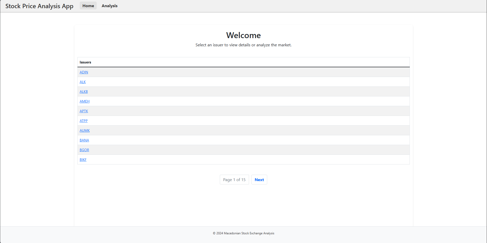
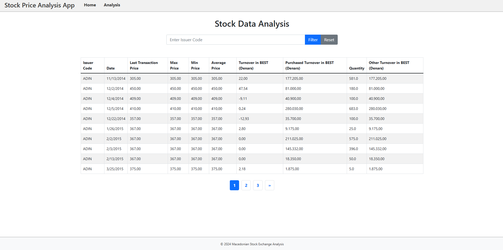
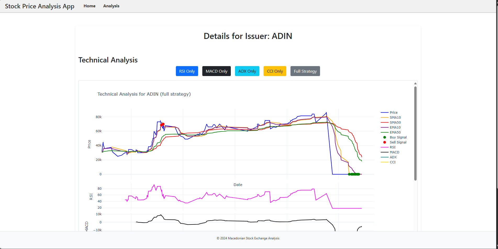
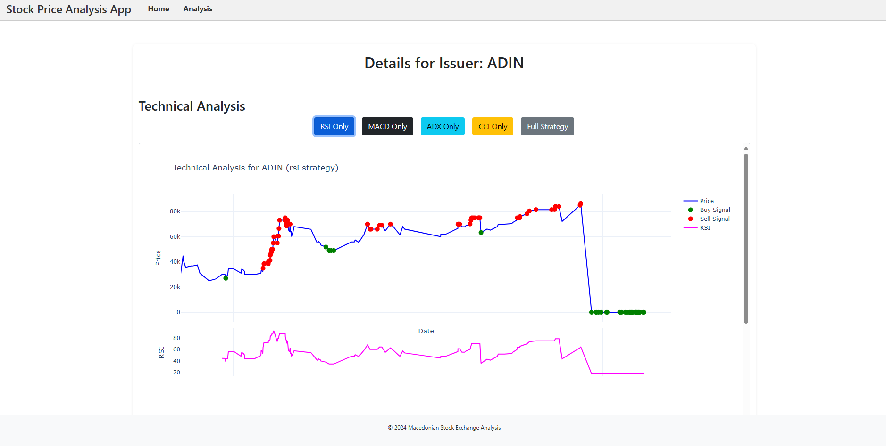
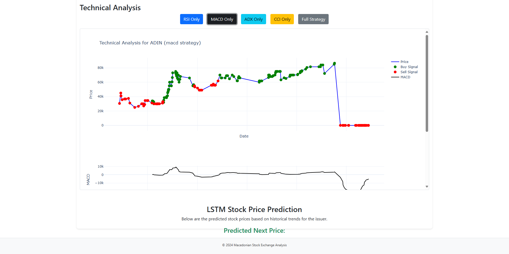
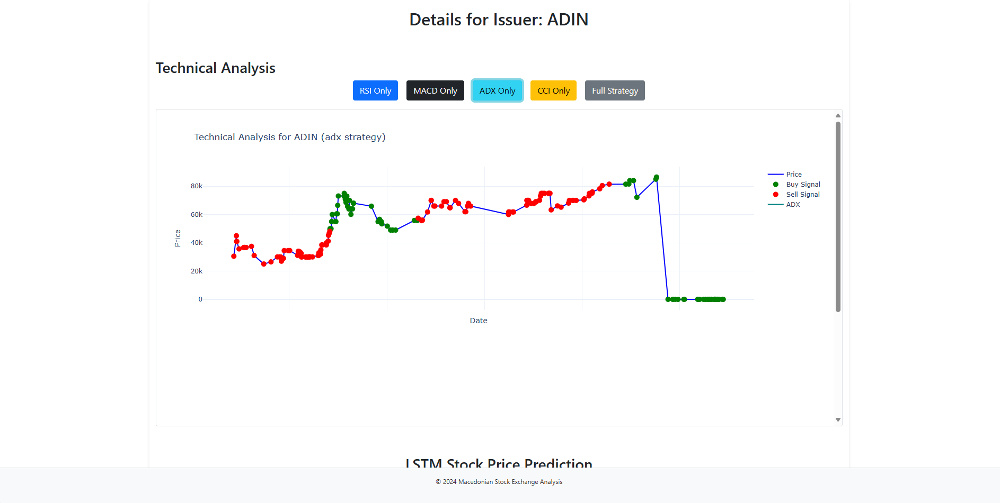
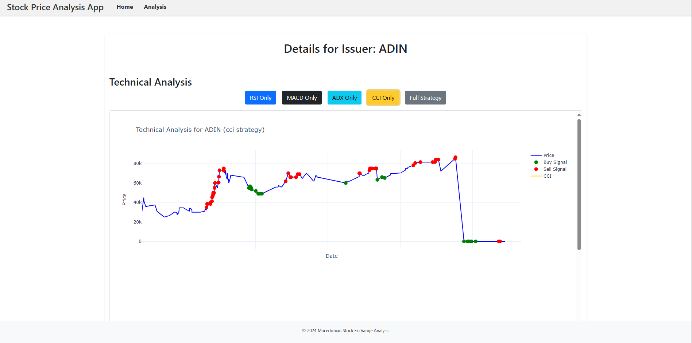
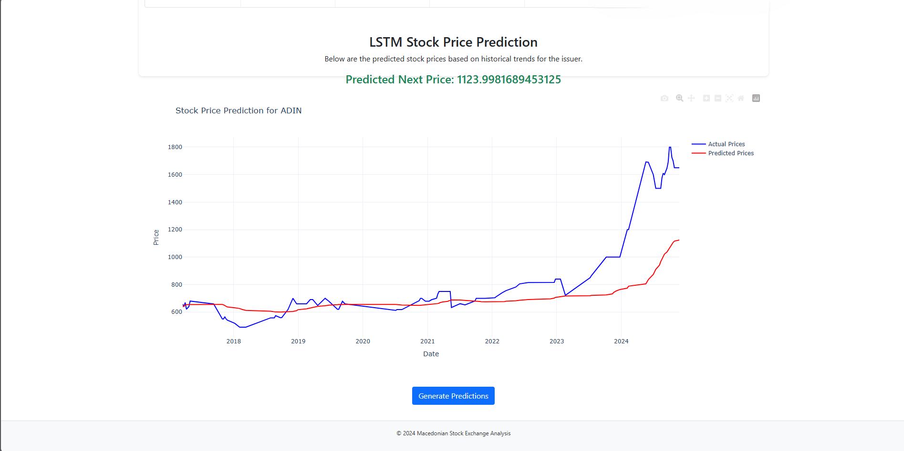

# Macedonian Stock Exchange Analysis App

## Overview
This project provides an analytical platform for tracking and predicting stock trends on the **Macedonian Stock Exchange**. It utilizes a **microservices architecture** with containerized components for prediction and strategy analysis.

## 📸 Project Screenshots

Here are a few images showing the look of the app:

### 🏠 Home Page


### 📊 Analysis Page


### 📈 Technical Analysis (Full Strategy)


### 📉 Technical Analysis (RSI Strategy)


### 📉 Technical Analysis (MACD Strategy)


### 📉 Technical Analysis (ADX Strategy)


### 📉 Technical Analysis (CCI Strategy)


### 🤖 Stock Price Prediction


## Installation & Running the Project
1. Clone the repository:
   ```sh
   git clone https://github.com/svuksanova/DIANS_final.git
   cd DIANS_final
   ```
2. Run the application using Docker:
   ```sh
   docker-compose up --build
   ```   
## Contributing
Feel free to open issues or submit pull requests to improve the project.

## License
This project is licensed under the **MIT License**.

---

